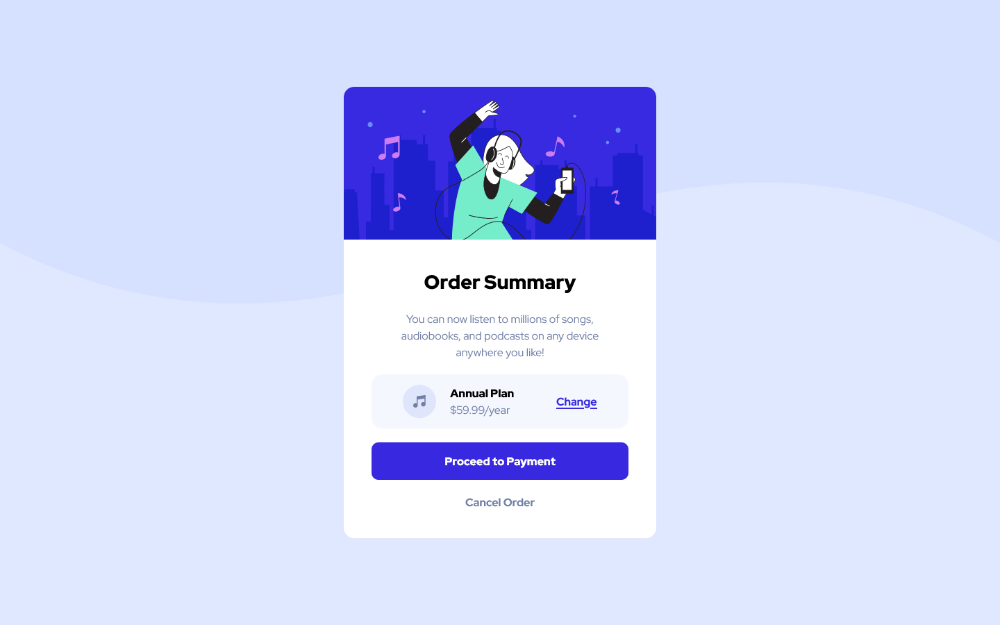
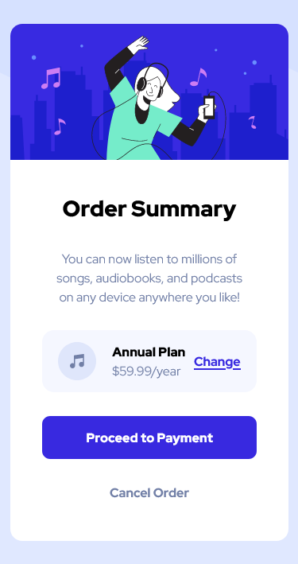

# Frontend Mentor - Order summary card

### Desktop Design Screenshot

### Mobile Design Screenshot

## Links
- Solution URL: https://github.com/FHernandez08/order-summary-component-main
- Live Site URL: https://order-summary-component-main-lyart.vercel.app/

## My Process
### Built With
- Media Queries
- Flexbox
- HTML
- CSS

### What I learned
From this project, I was able to learn how to properly implement a background to the main section of the webpage. I also, learned how to adjust from desktop to mobile.

### Continued Development
Continue working on both HTML and CSS, to later implement JavaScript which later on will implement React and Node.js.

### Author
- Frontend Mentor: @FHernandez08
